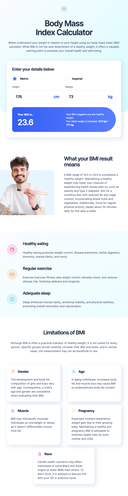

# Frontend Mentor - Body Mass Index Calculator solution

This is a solution to the [Body Mass Index Calculator challenge on Frontend Mentor](https://www.frontendmentor.io/challenges/body-mass-index-calculator-brrBkfSz1T).

### Screenshot

### Links

- Live Site URL: [fem-bmi-calc-toolboxal.netlify.app](https://fem-bmi-calc-toolboxal.netlify.app/)

## My process

### Built with

- React

### What I learned

The challenge to switch from metric and imperial units while calculating derived states. Learned to call functions inside jsx to live update BMI while user types into inputs, because of the lack of a form submit button.
